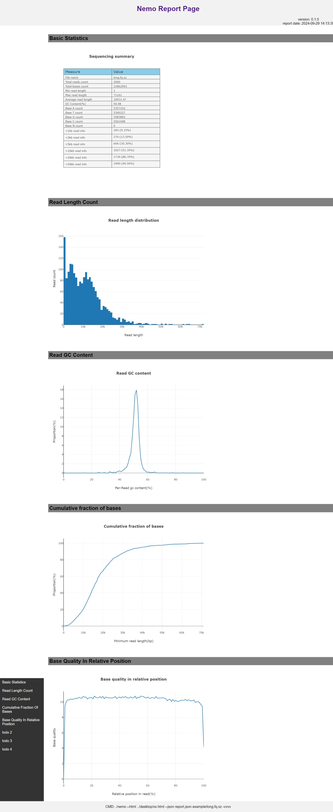

# nemo
🦀 A tool for quality overview of long-read sequencing data

#### **This tool is under active development**

## install
##### setp1： install cargo first 
```bash
curl --proto '=https' --tlsv1.2 -sSf https://sh.rustup.rs | sh
```

##### step2:  on linux or windows
```bash
git clone https://github.com/sharkLoc/nemo.git
cd nemo
cargo b --release
# mv target/release/nemo to anywhere you want 
```
##### install latest version

```bash
cargo install --git https://github.com/sharkLoc/nemo.git
```

## usage

```bash
nemo -- A tool for quality overview of long-read sequencing data

Version: 0.1.0
Authors: sharkLoc <mmtinfo@163.com>
Source code: https://github.com/sharkLoc/nemo.git

Usage: nemo [OPTIONS] [FILE]

Arguments:
  [FILE]  Input long reads sequence data, or read data from stdin

Options:
  -r, --html <FILE>           Specify the output HTML report file name [default: report.html]
  -o, --json <FILE>           Specify the output json file name [default: report.json]
      --log <FILE>            If file name specified, write log message to this file, or write to stderr
      --compress-level <INT>  Set compression level 1 (compress faster) - 9 (compress better) for gzip/bzip2/xz output file, just work with option -o/--json [default: 6]
  -v, --verbosity...          Control verbosity of logging, [-v: Error, -vv: Warn, -vvv: Info, -vvvv: Debug, -vvvvv: Trace, defalut: Debug]
  -q, --quiet                 Be quiet and do not show any extra information
  -h, --help                  prints help information
  -V, --version               prints version information

Use "nemo --help" for more information
```

## report page view:


#### ** any bugs please report issues **💖